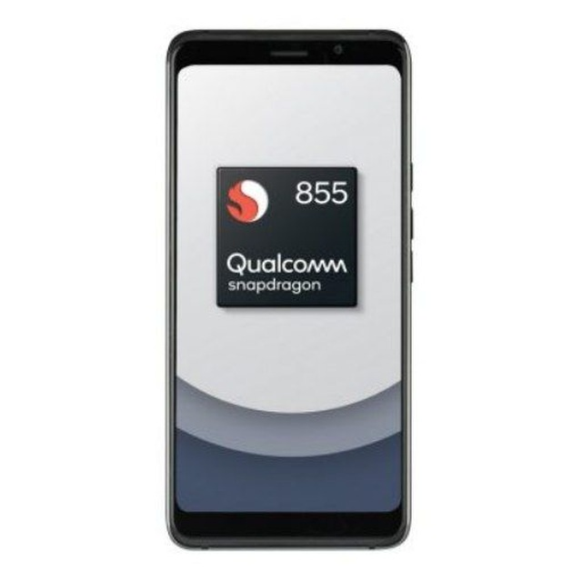

<h1>QRD855</h1> <h3>(Engineering sample from Qualcomm)</h3>

------------------------------------------
**📋 [Google Sheets — Device information](https://docs.google.com/spreadsheets/d/1JIjYHzJn0u3EdQyj9YVl3zGJn1ZMdcGG4T-iZdkqwig/edit?usp=sharing)

- ## Project Status:

- [ ] 🐧 Mainline linux kernel

- [x] 🐧⏬ Downstream linux kernel (by dev1qsion)

- [x] 🪟 WOA (Windows on ARM), WINPE booted (by gmdarmatura1)

- [x] 🐧📱 Linux PostMarketOS boot (by dev1qsion & gmdaramtura1)
---------------------------------------
**🔗 Links:**
- ## [TELEGRAM](https://t.me/qrd855)

